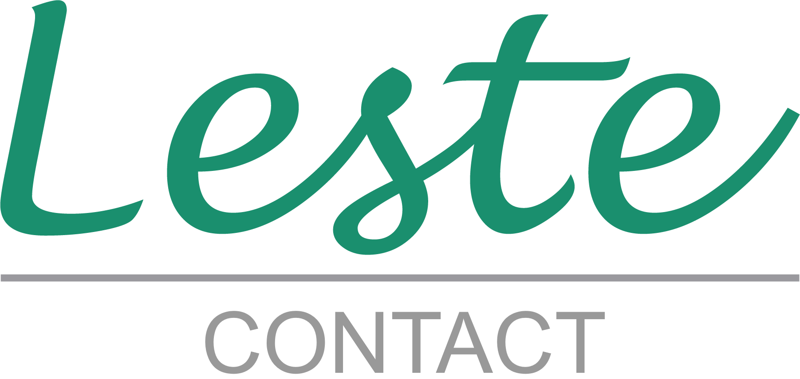

<h1 align="center">
  
</h1>

<h3 align="center">
  Leste Contact
</h3>

## :open_book: Lista de contatos

O **Leste Contact** é uma aplicação desenvolvida como parte de um desafio da <a href="https://www.lestetelecom.com.br/">Leste Telecom</a>. Nela, pode-se visualizar uma tela contendo múltiplos contatos, sendo possível a edição e deleção de contatos existentes, ou adição de novos. A tecnologia utilizada foi ReactJS, utilizando Styled Components.

### Deployment

<a href="desafio-leste.vercel.app">desafio-leste.vercel.app/</a>
</br>

### How to run ▶️
```bash
# Clone this repository
$ git clone <https://github.com/stonasss/desafio-leste.git>
# Access the project folder cmd/terminal
$ cd linkr
# Install the dependencies
$ npm install
# Run the application 
$ npm start
# The server will automatically start at localhost:3000/ on your favorite browser 
```